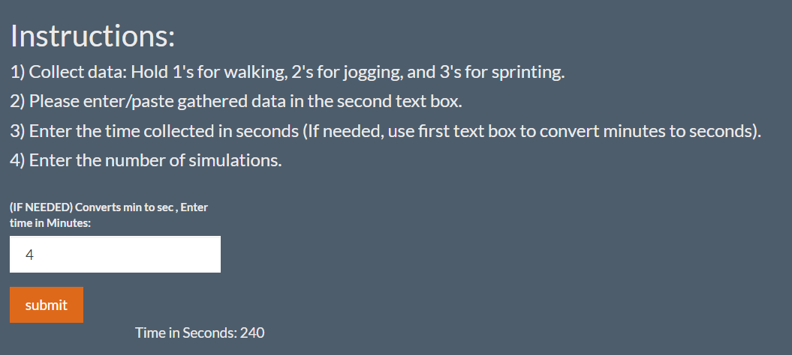
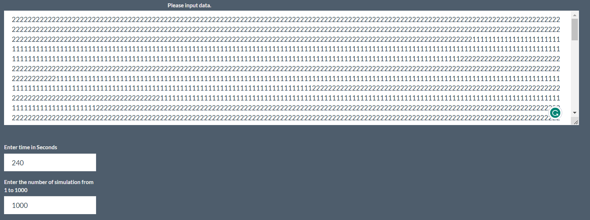
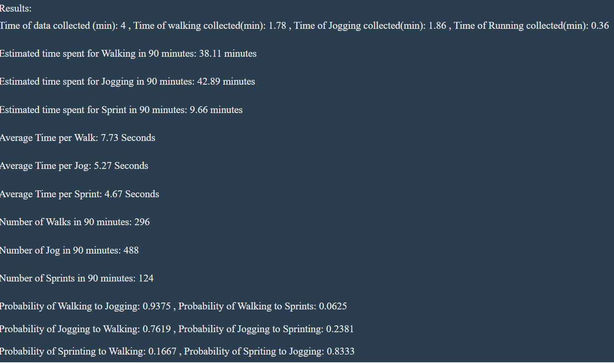
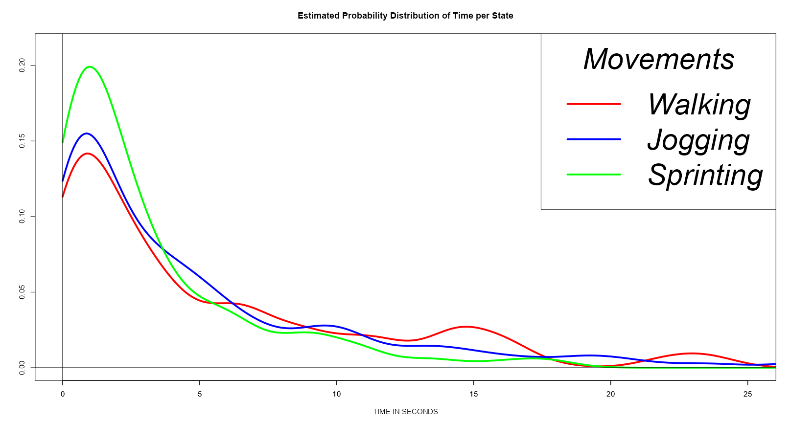
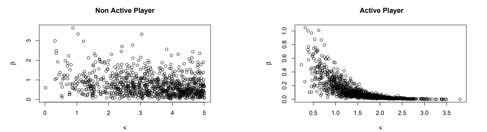

# Application of Markov Chain and Posterior Predictive Distribution to Model Soccer Movements

The primary objective of this project is to model the number of sprints per game and the duration of a sprint based on a small sample using Markov chain properties and the Bayesian posterior predictive distribution. Since  the number of sprints per 90-minute game and the distribution of sprint time per sprint would be of interest for soccer and/or fitness coaches. Knowing how their players move in the field (for instance how long they walk, sprint, and jog) can help coaches inform their training to better condition their athletes.

## Data Collection

Data is collected and input in the Rshiny application as follows. First represent the states walking, jogging and spiriting of a player to the values 1, 2, and 3 respectively. Hold down the appropriate key until the player changes movement then we change keys and record the total time that the player is observed. 

# Rshinny app

In this example, data was collected for a total time of 4 minutes and 1000 simulations.

Figure below shows the estimated time in each state, number of times player where in each state, and probabilities of going from one state to another state.

Figure shows the distribution of time for each state

## Statistical Methods

### Transition Probability Models

Assume Markov Chain for the three states: walking, jogging, and sprinting which is represented by 1, 2, and 3 respectively. Denote $\theta_{ij}$ as the probability of a player moving from state $i$ to state $j$ 

$$\begin{bmatrix}
0 & \theta_{01} & \theta_{02} \\
\theta_{10} & 0 & \theta_{12} \\
\theta_{20} & \theta_{21} &0 \\
\end{bmatrix}$$

For example, the probability of a player from sprinting to walking is denoted by $\theta_{20}$ 

Assume the transition probability $\theta_{20} \sim \text{Beta(a,b)}$ to model our belief where where $a$ and $b$ are hyperparameters. This the prior density for $\theta_{20}$ is 

$$
f(\theta_{20}) =  \frac{\Gamma(a+b)}{\Gamma(a) \Gamma(b)}   \theta_{20}^{a - 1} ( 1 - \theta_{20})^{b - 1}
$$

where $0 < \theta_{20} < 1$,  $a > 0$ , $b > 0$

Here $\frac{\Gamma(a)}{\Gamma(a) \Gamma(b)}$  is a normalizing constant. Thus, 

$$
f(\theta_{20}) \propto  \theta_{20} ^ {a - 1}  (  1 - \theta_{20}) ^ {b - 1}
$$

where $0 < \theta_{20} < 1$, $a > 0$, $b > 0$

### Likelihood function

Let $n_2$ denote the number of times a player is in state 2 (sprinting) during the time of data collection, and let $y_{20}$ denote the number of times a player changes from sprinting to walking. We assume $y_{20}$ as a binomial outcome since a player has only two states to change to. Therefore, the likelihood function (model for data) can be written as 

$$
f( y_{20} \mid \theta_{20}) =   \frac{n_2!}{y_{20}! (n_2 - y_{20} )!}  \theta_{20}^{y_{20}} ( 1  - \theta_{20})^{n_2 - y_{20}}
$$

 where $0 < \theta_{20} < 1$

By Bayes’s theorem the posterior distribution follows a Beta distribution denoted as  $\theta_{20} \mid  y_{20} \sim \mathrm{Beta}(a + y_{20} , b + n_2 - y_{20})$ 

From the posterior, we sample $\theta_{20}$ to make an inference for $\theta_{20}$ and other relevant parameters which depend on $\theta_{20}$. The same form of Beta posterior holds for jogging (for parameter $\theta_{10}$ and data $y_{10}$ and $n_1$) and walking (for $\theta_{01}$, $y_{01}$, and $n_0$).

Posterior calculation.

$$
f(\theta_{20} \mid {y_{20}} ) = \frac{f({y_{20}}\mid \theta_{20} ) f(\theta_{20})}{f(y_{20})}  
 \propto  f( {y_{20}} \mid \theta_{20})  f(\theta)
$$

Thus,

$$
f(\theta_{20} \mid {y_{20}} ) = \frac{n_2!}{y_{20}! (n_2 - y_{20} )!}  \theta_{20}\, ^  {y_{20}}  \, ( 1  - \theta_{20})^ {n_2 - y_{20}} \frac{\Gamma(a+b)}{\Gamma(a) \Gamma(b)}  \theta_{20}^\, {a - 1} ( 1 - \theta_{20})^{b - 1} \\ 
$$

Finally,

$$
f(\theta_{20} \mid {y_{20}} ) \propto (\theta_{20}) ^ {\, y_{20} + a - 1} (1 - \theta_{20}) ^ {n_2 - y_{20} + b - 1}
$$

where $0 < \theta_{20} < 1$, $a  > 0$, $b > 0$

The same posterior distribution holds for the other two states walking and jogging.

## Modeling time to sprint

We assume the Weibull distribution to model the time of a state. Let $t$ be the time of a print then

$$
f(t \mid \lambda, \kappa) = \frac{\kappa}{\lambda}\,\,   \left(\frac{t}{\lambda}\right)^{\kappa - 1} e ^{-(\frac{t}{\lambda})^\kappa}
$$

where  $t > 0$, $\kappa >0$, and $\lambda > 0$

Let $\beta = (\frac{1}{\lambda})^{\kappa}$ then 

$$
f(t \mid \beta , \kappa) = \kappa\,\ t ^ {\kappa -1}\,\ \beta \, e ^{- \beta \, ( t) ^ \kappa}
$$

denotes as $t \mid \beta, \kappa \sim \mathrm{Weibull}(\beta , \kappa )$

To model a sequence of independent sprint times, denoted by $\overrightarrow{t} = (t_1 , t_2,t_3,.....,t_n)$, we specify the likelihood function as 

$$
f(\overrightarrow{t} \mid \beta , \kappa) =   \prod_{i=1}^{n} 
\kappa\,\ t_i^{\kappa -1}\, \beta \, e ^{- \beta(t_i)^\kappa}
=\kappa^n \left(\prod_{i=1}^{n} t_i\right)^{\kappa - 1}\beta^n e^{-\beta(\sum_{i=1}^{\infty}t_i ^ \kappa)}
$$

### Prior distribution 

For the prior, we model $\beta$ and $\kappa$  independently for mathematical convenience, so that $f(\beta , \kappa) = f(\beta) \, f(\kappa)$. We will assume $\beta \sim   \mathrm{Gamma}(c,d)$ ,  where  $c > 0$ and $d > 0$ and we let the hyperparameters $c = d = 1$. As for $\kappa$ we assume a flat prior meaning $f(\kappa) \propto 1, \,\ 0 < \kappa < u$, where u is an arbitrary large number. For mathematical convenience let $u = 10 ^ {10}$. We let $u = 10 ^ {10}$ to provide an arbitrary large upper bound with a very weak prior. Therefore the joint prior can be expressed as

$$
f(\beta , \kappa) = f(\beta) \, f(\kappa)
                  \propto \frac{d ^  c}{\Gamma(c)}\beta^{c - 1} e ^ {-(d \cdot \beta)}(1) 
$$

### Posterior Distribution

Then the posterior of $(\beta , \kappa)$  is

$$
f(\beta , \kappa \mid \overrightarrow{t}) \propto f(\overrightarrow{t}  \mid \beta, \kappa) \cdot f(\beta , \kappa) \propto \beta ^ {c + n - 1} e ^ {- \beta (d + \sum_{i=1}^{n} t_i ^ \kappa)} \kappa ^ n \,\ \left(\prod_{i=1}^{n} t_i\right) ^ {k - 1}
$$

Used Gibbs sampling to the get samples of the two parameters $\beta$ and $\kappa$. When we sample $\beta$, we condition on the most recent posterior sample of $\kappa$, and vice versa.

When we condition on $\kappa$, we sample the posterior of $\beta$ from

$$
f(\beta \mid \kappa , \overrightarrow{t})\propto \beta^{c + n - 1} e^{- \beta (d + \sum_{i=1}^{n} t_i^\kappa)}
$$

which is a Gamma distribution and hence $\beta \mid \kappa , \overrightarrow{t}  \sim \mathrm{Gamma} (  c + n , d + \sum_{i=1}^{n} t_i ^ \kappa)$. When we condition on $\beta$, we sample the posterior of $\kappa$ from 

$$
f(\kappa \mid \beta , \overrightarrow{t}) \propto \beta ^ {c + n - 1} e ^ {- \beta (d + \sum_{i=1}^{n} t_i ^ \kappa)} \kappa ^ n \,\  \left(\prod_{i=1}^{n} t_i\right)^{k - 1}
$$

This method of sampling for the posterior of $\beta$ and $\kappa$ is similar for the time spent for walking and jogging.

##  Simulating Movements with the Posterior Draws

We can generate posterior predictive distributions of times spent for walking, jogging, and sprinting. We simulate the three states and the times of each state until the cumulative time reaches 90 minutes.

The simulation procedure can be summarized in the following 6 steps:

1. We will first initialize a state, we start with $s_1$
2. We sample the $(\beta , \kappa)$  from the relevant prior.
3. Sample time $t$ of the state from the relevant Weibull Distribution with the sample $(\beta , \kappa)$ from step 2.
4. Then sample $\theta_{i j}$ from the posterior.
5. Let $s_{i+1} = j$  with probability of $\theta_{s_i, j}$ or $s_{i+1} = k$ with probability  $\theta_{s_i, k} = 1 - \theta_{s_i, j}$. 
6. Repeat steps 2 to 5 for new states $s_2,s_3,s_4,s_5....$ and stop when the sum of the times of all states exceeds 90 minutes.

During this process we track how many times step 5 resulted in a sprint and calculate the average time spent sprinting by calculating the mean sprints from the relevant Weibull distribution.

The figure below compares the posterior distribution of $\kappa$ and $\beta$ of two players. The left panel is for a player who was not very active during the 5 minutes of data collection, and the right panel is for a player who was relatively active (in terms of sprinting). Comparing the two posterior distributions, we see that the non active player’s posterior is more spread out than the active player’s posterior.

